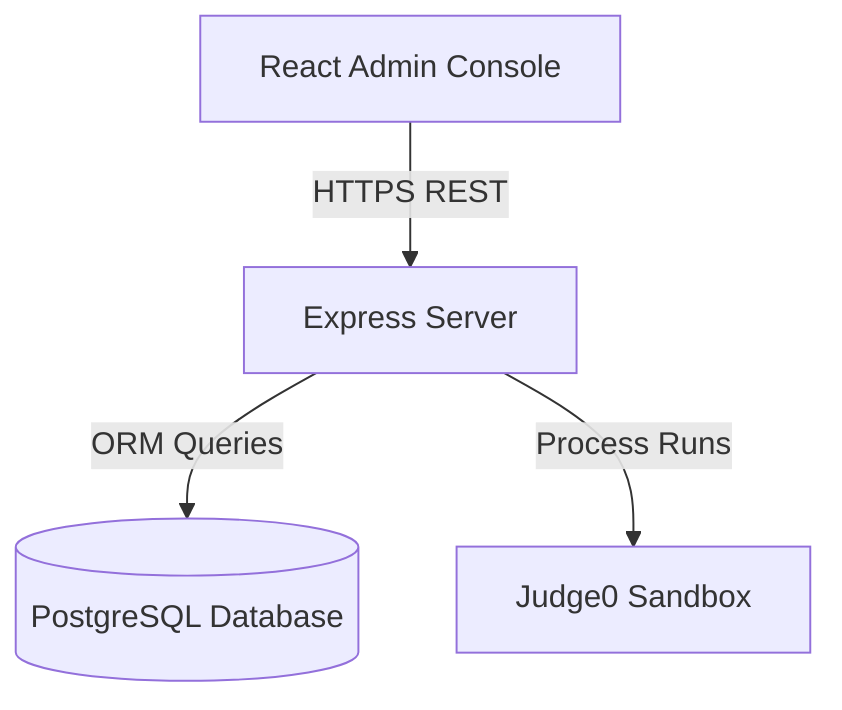

# CodeMatch Administration & Operations Manual

This manual provides detailed guidelines and checklists for platform administrators operating the CodeMatch portal.

---

## 1. Platform Overview

### Platform Architecture
CodeMatch uses a decoupled client-server architecture. System components communicate via HTTPS REST interfaces and live WebSockets.



### Administrative Roles & Permission Matrix
* **Super Admin**: Complete structural database operations, migrations, roles assignments, and systems telemetry.
* **Moderator**: Manage reports queues, delete flags, edit solutions, and moderate community comments.

| Permission | Super Admin | Moderator | Student |
|---|---|---|---|
| Configure Systems | Yes | No | No |
| Create Problems | Yes | Yes | No |
| Resolve Reports | Yes | Yes | No |
| Submit Code | Yes | Yes | Yes |

---

## 2. Platform Telemetry Dashboard

```
+-------------------------------------------------------------+
|  [CodeMatch Admin]   Health: DB OK  |  Server OK  |  Queue: 0|
+-------------------------------------------------------------+
|                                                             |
|   Platform Statistics Summary                               |
|   +-------------------+   +------------------+              |
|   | 👤 Users: 10      |   | 💻 Problems: 3   |              |
|   +-------------------+   +------------------+              |
|                                                             |
|   🔔 Latest Notifications | 📜 Audit Activity Logs          |
|   - Welcome email sent    | - Jane created problem (12:05)  |
|   - Database backup done  | - System config updated (12:10) |
+-------------------------------------------------------------+
```

### Dashboard Widgets
1. **Total Users Card**: Displays cumulative student registrations.
2. **Problems & Solutions Card**: Displays challenge indexes.
3. **Database Health Card**: Measures raw latency and query limits.

---

## 3. Incident Response Guide

### Scenario 1: Sandbox Compiler Offline
1. Check compiler service connection via the health console.
2. Run connectivity check:
   ```powershell
   curl -I http://localhost:2358/health
   ```
3. Restart compiler containers if connection fails.

---

## 4. Maintenance Checklists

### Daily Checklists
- [ ] Verify database latency is below `50ms`.
- [ ] Confirm no active reports are older than 24 hours in the queue.
- [ ] Review system access logs for anomalous IP addresses.

### Weekly Checklists
- [ ] Verify pg_dump backup script completed successfully.
- [ ] Run diagnostic checks on Judge0 sandbox execution files.
- [ ] Analyze CPU usage graphs on Render or local servers.
