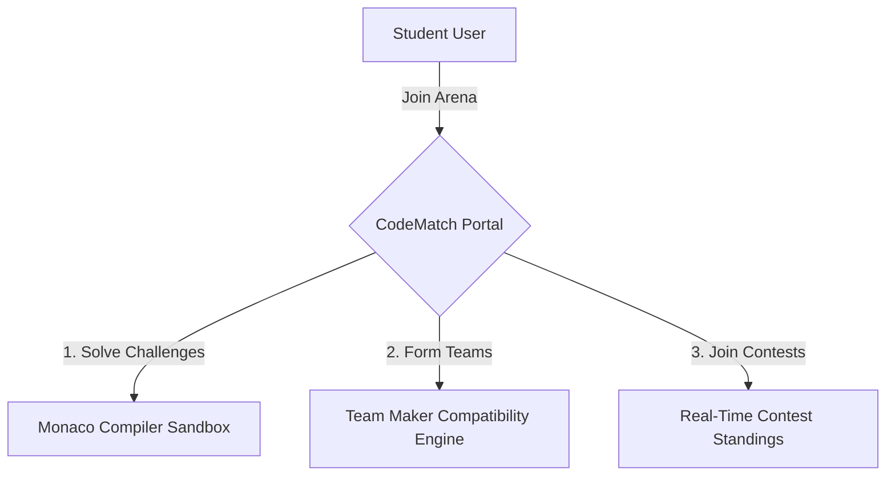
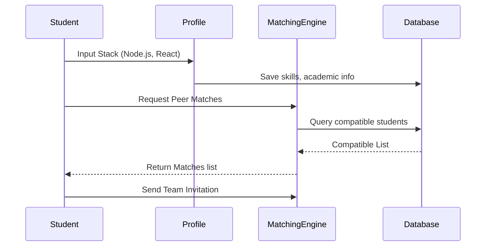
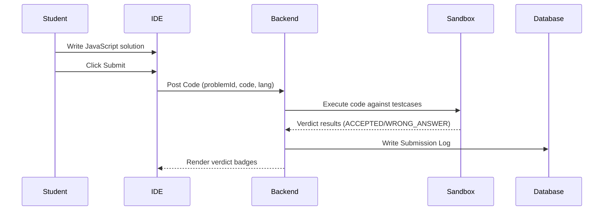
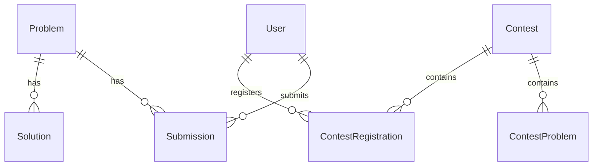

# CodeMatch Architecture & Operations Manual

---

## 1. Introduction

### What is CodeMatch?
CodeMatch is a collaborative developer platform designed to merge individual competitive programming workspaces with automated team-matching ecosystems. By providing real-time code evaluation sandboxes alongside dynamic compatibility mapping, the platform allows student developers to hone their technical skills while finding compatible teammates for projects, hackathons, and long-term academic collaborations.



### Who Should Use CodeMatch?
1. **Students**: Individuals looking to improve their problem-solving speeds and find teammates based on academic compatibility and shared stacks.
2. **Administrators**: Academic moderators or challenge creators who manage coding problems, verify testcases, and publish coding contests.
3. **Future Recruiters**: Corporate partners seeking verified performance logs, real-time code execution scores, and collaborative team activity metrics.
4. **Future Mentors**: Experienced engineers review student projects and guide team architectures.

### Main Objectives
- **Automate Teammate Matching**: Match users based on skills, interests, and matching profiles to reduce friction in manual team forming.
- **Provide Sandbox Compiler Environments**: Compile multi-language codes locally using a secure process execution driver.
- **Deliver Real-time Performance Tracking**: Track solve statuses, penalty metrics, and contest standings instantly.

### Key Features
* **Interactive Monaco IDE**: Code solving workspace supporting automatic drafting, custom stdin streaming, and custom font size controls.
* **SaaS Dashboards**: View user registration status, upcoming events, system telemetry, and match metrics.
* **Leaderboards & Contests**: Compete in practice, public, private, or recruitment contests with automated penalty-score calculation.
* **Discussions & Editorials**: Read step-by-step algorithms walkthroughs and participate in topic-related community discussions.

---

## 2. User Roles

| Role | Purpose | Operations Scope | Access Level |
|---|---|---|---|
| **Student** | Solve challenges, match with peers, form teams, compete in live contests. | Register profiles, submit code solutions, join match pools, create teams. | Base Level (User) |
| **Admin** | Manage problems list, seed official solutions, moderate users, configure contest rules. | Create problems/testcases, publish announcements, manage database migrations. | Elevated (Full) |
| **Recruiter** | Identify talent using performance indexes and team project deliverables. | View verified submissions analytics, college stats, and candidate portfolios. | Read-Only (Recruitment) |
| **Mentor** | Review project codes, provide architectural tips, and moderate discussion boards. | Edit comments, flag reports, read solutions walkthroughs. | Elevated (Moderator) |

---

## 3. Student Guide

### Page 1: Dashboard

```
+-------------------------------------------------------------+
|  [CodeMatch]   Dashboard    Profile    Problems    Contests |
+-------------------------------------------------------------+
|                                                             |
|   Welcome Back, Student!                                    |
|   +-----------------------+   +-------------------------+   |
|   | 💡 Active Challenges   |   | 📅 Live Arena Match     |   |
|   | - Two Sum (EASY)      |   | Weekly Showdown #1      |   |
|   | - Fibonacci (EASY)    |   | Ends in: 01h 45m        |   |
|   +-----------------------+   +-------------------------+   |
|                                                             |
|   +-----------------------------------------------------+   |
|   | 📊 Performance Summary                              |   |
|   | Solved: 15/45 | Accuracy: 78% | Team Matching: Active|   |
|   +-----------------------------------------------------+   |
+-------------------------------------------------------------+
```

* **Purpose**: Serves as the landing hub for users, compiling matches compatibility, upcoming challenges, and running contests.
* **Key Features**:
  * Quick links to solve active problems.
  * Real-time countdown markers for active contest entries.
  * Matching pool opt-in states.
* **Expected Result**: Displays custom progress analytics from PostgreSQL without lag.
* **Common Mistakes**: Forgetting to toggle the matching availability checkbox, leading to zero peer match notifications.

### Page 2: Developer Profile
* **Purpose**: Displays academic parameters, Git repository links, solved challenge tallies, and technology stacks.
* **Key Features**:
  * SOLVED challenges count ring chart.
  * College information inputs (SchoolName, AcademicYear, Department).
  * Direct Git profile integration link.
* **Expected Result**: Saving changes writes to the database immediately and updates the dashboard compatibility metric.
* **Common Mistakes**: Leaving stack skills blank, causing the matching system to rank the profile lower due to insufficient information.

### Page 3: Problem Browser Table
* **Purpose**: Provides a searchable list of practice challenges with sorting and filtering options.
* **Key Features**:
  * Filter by difficulty (Easy, Medium, Hard), tags, categories, or company.
  * Solved status trackers (Solved, Attempted, Unsolved).
  * Bookmark button to save challenges to a personal list.
* **Expected Result**: Page results load progressively using offset pagination.

### Page 4: Monaco IDE Solver Page
* **Purpose**: Editor dashboard interface where users write and verify challenge solutions.
* **Key Features**:
  * Multi-language selection (JavaScript, Python, C++, C, Java).
  * Custom Stdin tab for testing code against custom inputs.
  * Real-time compilation outputs showing runtime (ms) and memory footprint.
* **Workflow**:
  1. Read constraints and example test cases in the left column.
  2. Select programming language and write solution in center editor.
  3. Click **Run Code** to dry-run solution against sample cases.
  4. Click **Submit Solution** to run code against all test cases.
* **Expected Result**: Accept status updates the global challenge score immediately.
* **Common Mistakes**: Writing infinite loops that exceed the sandbox execution time limit (5 seconds), resulting in a `TIME_LIMIT_EXCEEDED` verdict.

---

## 4. Admin Guide

### Page 1: Admin Console
* **Purpose**: Central command interface for moderators to review system health, database metrics, and active users count.
* **Key Features**:
  * Total submissions line chart.
  * Pending reports queue tally.
  * Telemetry displays showing Judge0 response state.
* **Workflow**: Select management sub-panels from the sidebar navigation.

### Page 2: Solution Manager
* **Purpose**: Create and edit official solution guidelines and complexity scores for every problem.
* **Key Features**:
  * Text area supporting markdown code blocks.
  * Time and space complexity fields (e.g. `O(N log N)`).
  * Visibility toggle (PUBLIC/PRIVATE).
* **Expected Result**: Saving updates the student solutions database and hides solutions from players who haven't solved the problem yet.

---

## 5. Platform Workflows

### Student Onboarding & Teaming Flow


### Code Submission Flow


---

## 6. Folder Structure

```
codematch/
├── backend/
│   ├── prisma/
│   │   ├── schema.prisma          # Database schemas definitions
│   │   └── seed.js                # Core database seeding script
│   └── src/
│       ├── app.js                 # App configuration & route mounts
│       ├── server.js              # Server entry point & socket binds
│       ├── middleware/            # JWT authentication & validate rules
│       └── modules/               # Subsystems (auth, teams, solutions)
└── frontend/
    ├── src/
    │   ├── api/
    │   │   └── axios.js           # Network interceptors
    │   ├── pages/
    │   │   ├── Problems/          # Problems list and Monaco solver
    │   │   └── Submissions/       # Submissions history
    │   └── App.jsx                # Router route mappings
    └── vite.config.js             # Asset compile setup
```

---

## 7. API Overview

### Submissions API Prefix: `/api/submissions`

| Method | Path | Request Body | Response Format | Purpose |
|---|---|---|---|---|
| **POST** | `/run` | `{ problemId, code, language }` | `{ success: true, data: { status, results } }` | Runs code against public test cases. |
| **POST** | `/submit` | `{ problemId, code, language }` | `{ success: true, data: { submission, executionResult } }` | Saves code to database and runs all test cases. |
| **GET** | `/stats` | *None* | `{ success: true, data: { totalSubmissions, solvedProblemsCount } }` | Gets cumulative user statistics. |
| **GET** | `/draft` | *Query params* | `{ success: true, data: { code } }` | Restores autosaved code draft. |

### Solutions API Prefix: `/api/solutions`

| Method | Path | Request Body | Response Format | Purpose |
|---|---|---|---|---|
| **POST** | `/` | `{ problemId, title, language, approach, stepExplanation, code }` | `{ success: true, data: { id } }` | Creates official solution (Admin only). |
| **GET** | `/` | *Query params* | `{ success: true, data: [solutions] }` | Gets solutions (User solved check enforced). |

---

## 8. Database Overview

### Entity Relationship Diagram (High-Level)


### 1. User Table
* **Purpose**: Stores profile, credentials, and academic parameters.
* **Relations**: One-to-many with `Submission`, `TeamMember`, `ContestRegistration`.

### 2. Submission Table
* **Purpose**: Logs code execution scores, runtime, memory usage, and execution status.
* **Relations**: References `User` (userId) and `Problem` (problemId) as foreign keys.

### 3. Solution Table
* **Purpose**: Stores official algorithmic approaches, step explanations, and time complexities.
* **Relations**: References `Problem` (problemId). Links to `SolutionApproach`, `SolutionExplanation`, `SolutionComplexity`.

---

## 9. Frequently Asked Questions

### Student FAQs
1. **Why is my code timing out?**
   * The server limits execution to 5 seconds per test case. Optimize your code's time complexity to avoid the `TIME_LIMIT_EXCEEDED` verdict.
2. **Can I see official solutions before solving?**
   * No. Solutions are locked until you solve the problem, unless the problem settings allow public editorials.

### Admin FAQs
1. **How do I register a new coding language?**
   * Update the driver code configurations in `execution.service.js` and add the language to the dropdown options in the frontend.

---

## 10. Troubleshooting

### 1. Database Lock Issues
* **Symptoms**: Prisma CLI throws database connection errors.
* **Resolution**: Terminate dangling node processes and ensure the local PostgreSQL service is running:
  ```powershell
  taskkill /F /IM node.exe
  net start postgresql-x64-16
  ```

### 2. Judge0 / Sandbox Process Errors
* **Symptoms**: Solution submissions return generic runtime errors.
* **Resolution**: Ensure compiler dependencies (`g++`, `gcc`, `java`, `python`) are added to the system PATH.

---

## 11. Roadmap
1. **AI Code Review**: Automated code feedback using large language models.
2. **Recruitment**: Corporate matching system using verified student profiles.
3. **Interview Platform**: Collaborative pair programming IDE with live video calling.
